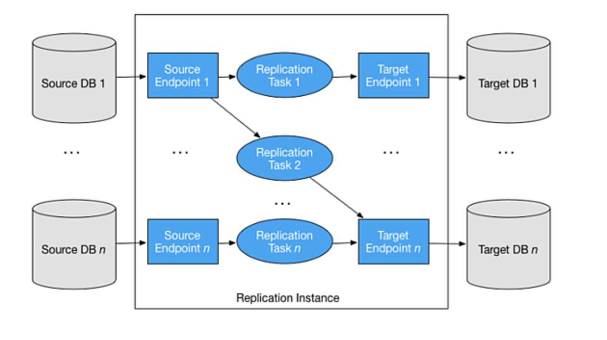
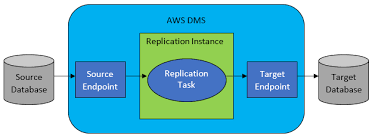
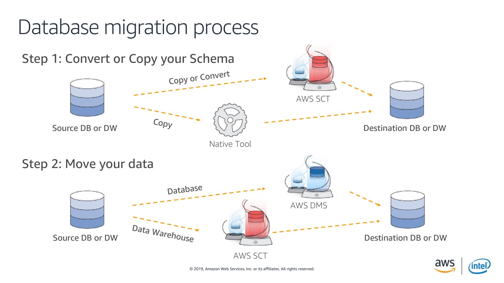
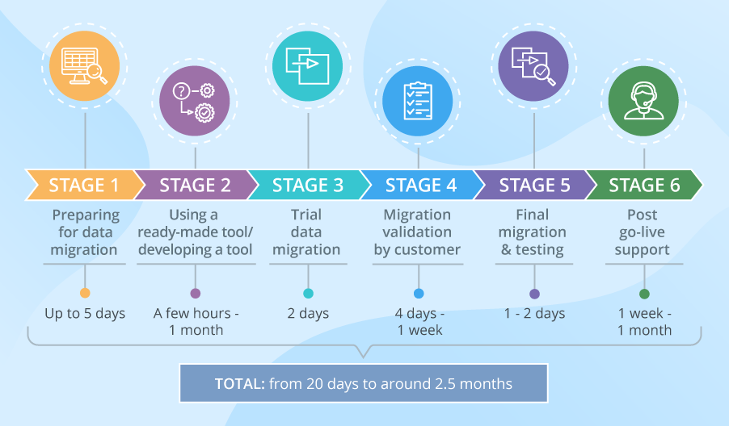
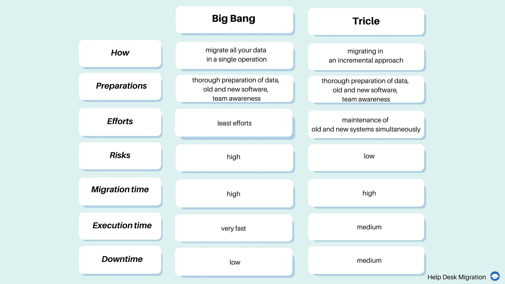

# Step by step how DB migration works ?

[]

[]

[]

# What is Delta sync in migration?

A delta migration only moves modified files since the last migration that was executed. This is done by comparing the modified timestamps between the source and destination platforms. There are a couple benefits from using delta migrations, the remainder of this article will touch on a few of these.

# What is a Delta data transfer?

Delta encoding is a way of storing or transmitting data in the form of differences (deltas) between sequential data rather than complete files; more generally this is known as data differencing.

# What is cross database migration?

Cross-Database Studio allows migrating and transferring database schemas and data across different database types. The database migration with Cross-Database Studio is easy, intuitive, configurable and ensures reliability and data integrity.

steps in migrating to the new database ?

[]

# big bang data migration, trickle data migration ?

[]